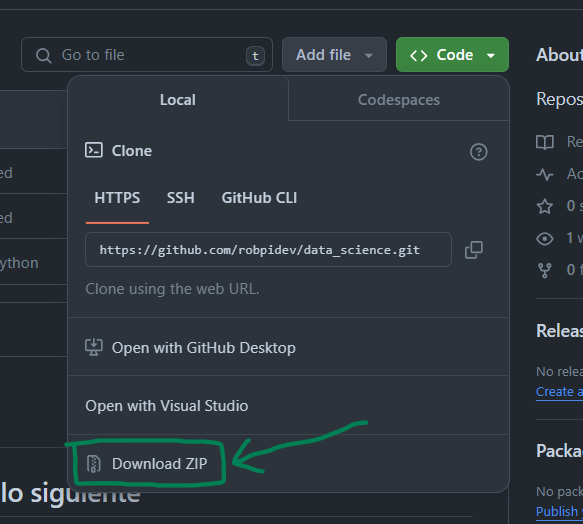

# Data Science

## 1. Para trabajar con vscode se nececita lo siguiente

* Extensión de jupyter notebook en vscode:
[instalalo aquí](https://marketplace.visualstudio.com/items?itemName=ms-toolsai.jupyter)

* Autocompletado extención de vscode:
[instalalo aquí](https://marketplace.visualstudio.com/items?itemName=ms-python.python)

* [Python](https://www.python.org/ftp/python/3.12.3/python-3.12.3-amd64.exe)

### 2. Paquetes para el análisis de datos

Se tiene que instalar los quientes paquetes para
python (En una terminal) escribir los comandos.

Pandas

```shell
pip install pandas
```

Numpy

```shell
pip install numpy
```

scikit-learn: regresiones

```shell
pip install scikit-learn
```

Matplotlib

```shell
pip install matplotlib
```

## 2. Descargar el código

Si no usas **git**, etonces descarga este código ```.zip``` y descomprimelo




