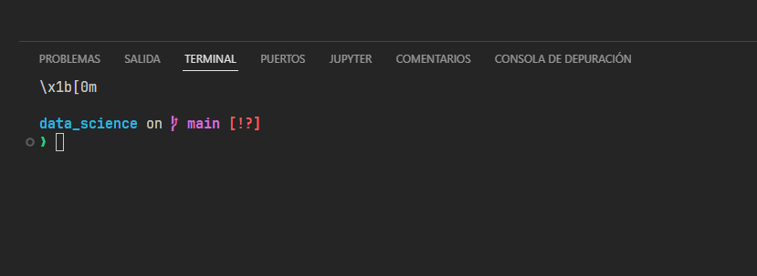

# Data Science

## 1. Para trabajar con vscode se nececita lo siguiente

* Extensión de jupyter notebook en vscode:
[instalalo aquí](https://marketplace.visualstudio.com/items?itemName=ms-toolsai.jupyter)

* Autocompletado extención de vscode:
[instalalo aquí](https://marketplace.visualstudio.com/items?itemName=ms-python.python)

* [Python](https://www.python.org/ftp/python/3.12.3/python-3.12.3-amd64.exe)

### 2. Paquetes para el análisis de datos

Se tiene que instalar los quientes paquetes para
python (En una terminal) escribir los comandos.

Abre vscode


Y aqui ejecutarás los siguientes comandos


Pandas: Para leer archivos

```shell
pip install pandas
```

Numpy: Funciones matmáticas

```shell
pip install numpy
```

scikit-learn: Machine learning

```shell
pip install scikit-learn
```

Matplotlib: Gráficos

```shell
pip install matplotlib
```

Seaborn: Gráficos

```shell
pip install seaborn
```

```shell
pip install Jinja2
```

## 2. Descargar el código

Si no usas **git**, etonces descarga este código ```.zip``` y descomprimelo


Luego abre esta carpeta desde vscode


El archivo con el que se va a trabar es el test01.ipynb

